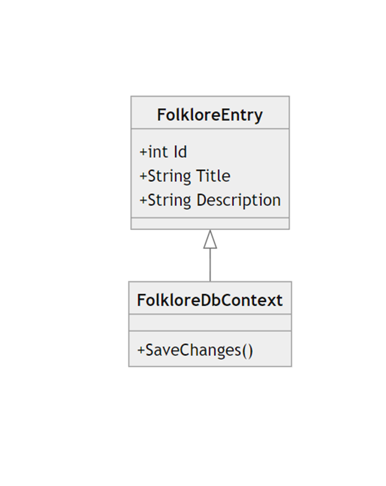
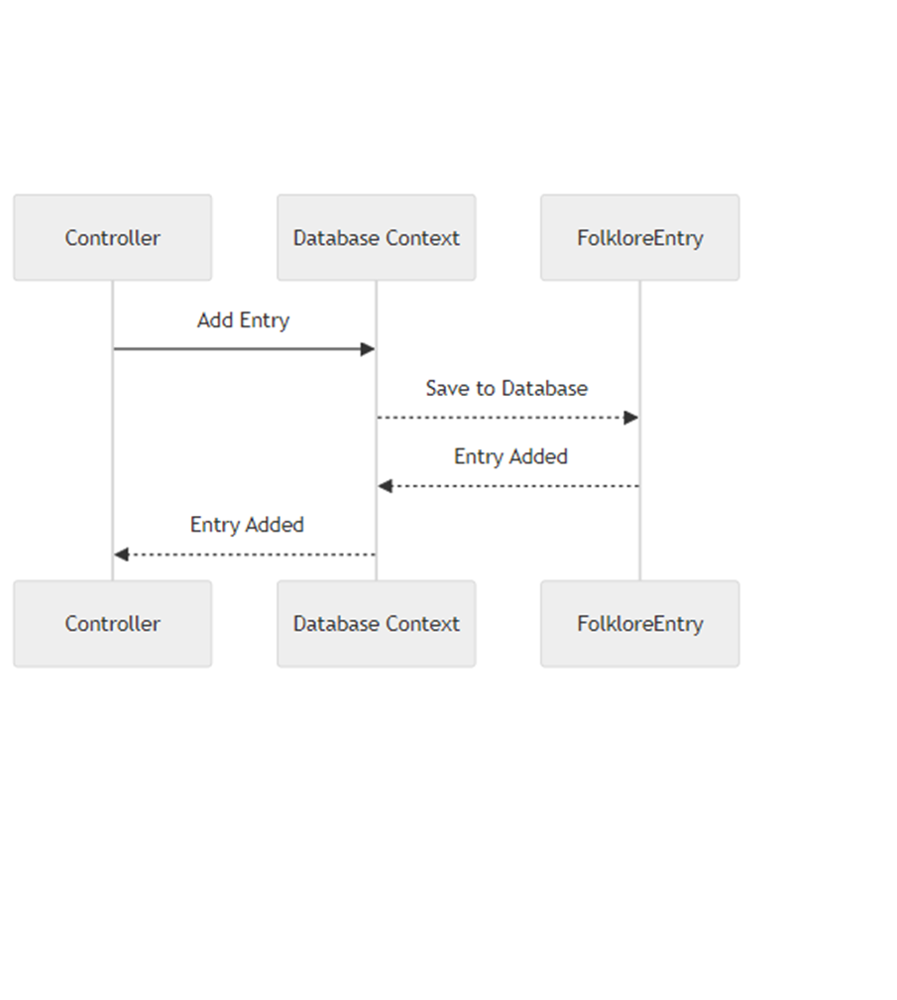
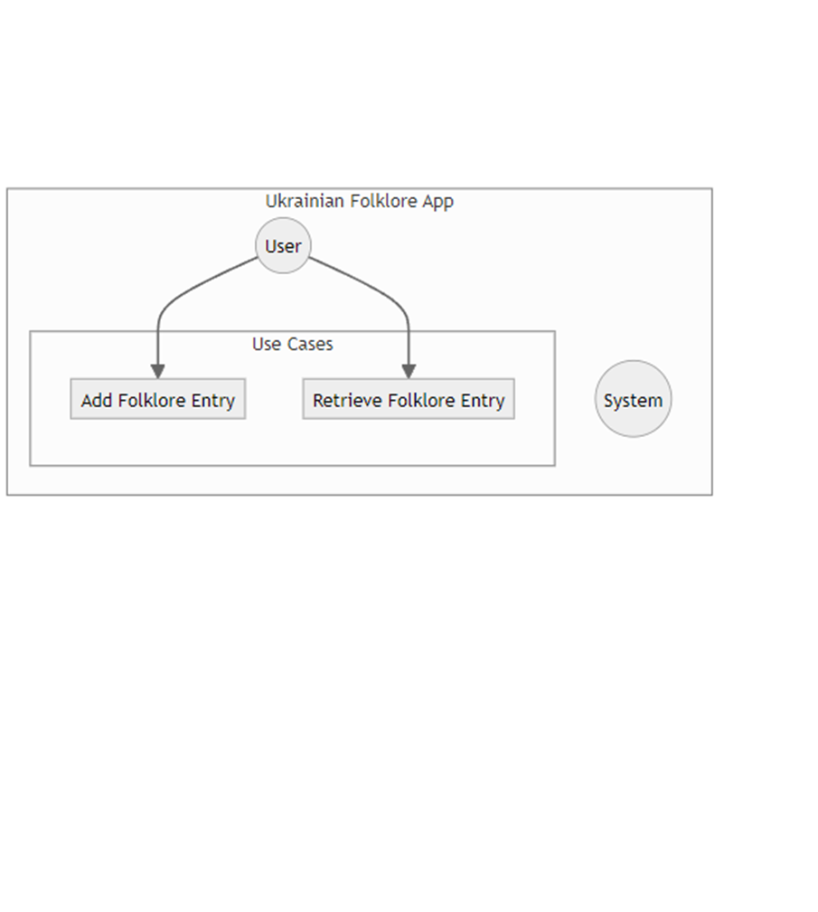

# Software documentation

## Introduction
Complete documentation for the Ukrainian Folklore Database App is provided in this page. Offering a thorough reference manual to developers, testers, and other project stakeholders is the goal.

## Scope of the software
The management and display of Ukrainian folklore entries is the purpose of the Ukrainian Folklore Database App. Important characteristics consist of:

Including titles and descriptions for newly added folklore entries.
locating and presenting already-existing folklore entries.

### Requirements
-ASP.NET Core
-Entity Framework Core
-SQL Server (or another supported database)
-Development IDE (e.g., Visual Studio)

## Software architecture
The software follows an ASP.NET Core MVC (Model-View-Controller) architecture. This design ensures separation of concerns and modularity in handling requests, managing data, and presenting views.

## Software design and model(UML Diagrams)
 This diagram illustrates the structure of my system in terms of classes and their relationships.
 This diagram visualizes the interactions and order of events between different components or objects in a particular use case.
 This diagram defines and display various use cases that your system must support.

## Test cases

